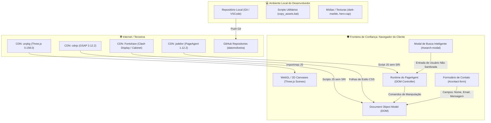

# 02 — Arquitetura e Superfície de Ataque

**Projeto:** ÁSPERUS (`datomoliveira/asperus`)  
**Data:** 07 de setembro de 2026  
**Padrão:** OWASP Threat Modeling / ASVS 5.0 Chapter V15

---

## 1. Visão Arquitetural e Limites de Confiança (Trust Boundaries)

O **ÁSPERUS** adota uma arquitetura *Single-Page Web Application* essencialmente estática e orientada a gráficos interativos no cliente. A renderização de cena 3D (Three.js), timelines de scroll (GSAP ScrollTrigger) e o assistente de navegação (PageAgent) ocorrem 100% no contexto do navegador do usuário (*User Agent*).

### Diagrama de Fluxo e Fronteiras de Confiança (Mermaid)

---

## 2. Inventário de Ativos de Maior Valor ("Crown Jewels")

1. **Reputação e Marca ÁSPERUS / Renato Maia:** Como estúdio solo de engenharia de software para clientes de alto padrão (CTOs e fundadores), qualquer adulteração de código (defacement), injeção de scripts maliciosos ou redirecionamento falso causaria dano desproporcional à credibilidade profissional.
2. **Privacidade dos Dados de Contato:** Informações inseridas no formulário de contato (nome, e-mail comercial e descrição confidencial de novos projetos ou orçamentos de potenciais clientes).
3. **Integridade da Execução Client-Side:** Garantia de que nenhum script de terceiro injete mineradores de criptomoeda, roubo de credenciais ou execute ações arbitrárias na máquina do visitante.

---

## 3. Superfície de Entrada e Egress

### 3.1 Pontos de Entrada de Dados (Ingress)
* **Campo de Busca Inteligente (`#search-input`):** Recebe strings de texto livre digitadas pelo usuário no modal de assistência em tempo real.
* **Formulário de Contato (`#contact-form`):**
  * `input#field-name` (nome do interessado)
  * `input#field-email` (e-mail para retorno)
  * `textarea#field-msg` (descrição da demanda técnica)
* **Parâmetros de URL e Fragmentos (`#hash`):** Utilizados para navegação suave interna entre âncoras (`#about`, `#services`, `#projects`, `#contact`).

### 3.2 Pontos de Saída de Dados (Egress)
* Requisições HTTP GET externas para carregamento inicial de assets nas CDNs (`cdnjs`, `unpkg`, `jsdelivr`, `fontshare`).
* Links externos para perfis públicos (`https://github.com/datomoliveira`, `mailto:renato@asperus.dev`).
