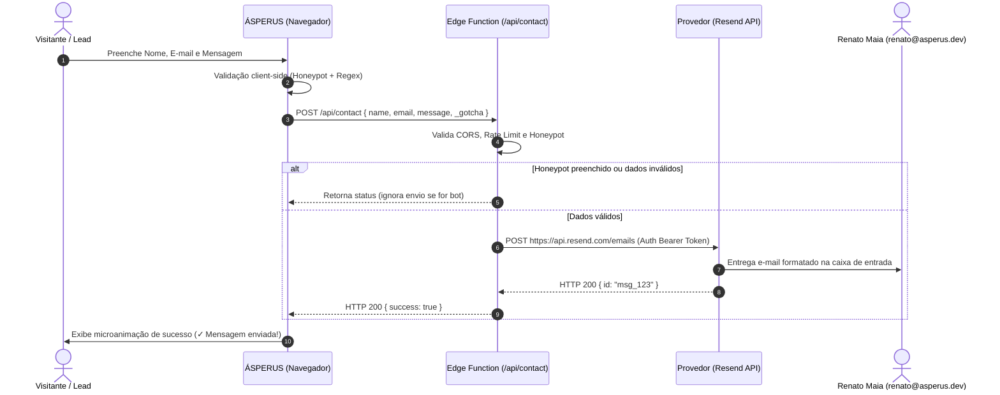

# Plano Técnico: Conexão do Formulário de Contato a Backend Serverless

<!-- specify:plan 1.0.0 -->
**Especificação de Referência:** `specs/001-contact-backend-api/spec.md`  
**Autor:** Renato Maia (`datomoliveira`) / Antigravity AI  
**Status:** Pronto para Implementação  
**Data:** 2026-09-07

---

## 1. Visão Geral da Arquitetura Técnica

A arquitetura recomendada para o ÁSPERUS é uma **Edge Function serverless** leve (como Cloudflare Workers ou Supabase Edge Functions) acoplada ao serviço de e-mail transacional **Resend** (que oferece plano gratuito generoso com entrega instantânea e zero fricção).



---

## 2. Inventário de Arquivos Afetados

### Novos Arquivos [NEW]
* `specs/001-contact-backend-api/worker-example.js`: Código-fonte de referência da Edge Function (pronto para deploy no Cloudflare Workers ou Supabase).

### Arquivos Modificados [MODIFY]
* `js/app.js`: Substituição da simulação estática em `initContactForm()` pelo `fetch` real assíncrono para o endpoint configurado.
* `index.html`: Ajuste de diretiva CSP em `connect-src` para autorizar o domínio da Edge Function.

---

## 3. Contrato de API (REST Payload)

### Requisição
* **Método:** `POST`
* **Headers:** `Content-Type: application/json`
* **Corpo (JSON):**
  ```json
  {
    "name": "Nome do Interessado",
    "email": "contato@empresa.com",
    "message": "Gostaria de solicitar orçamento para MVP...",
    "_gotcha": ""
  }
  ```

### Resposta de Sucesso (HTTP 200)
```json
{
  "success": true,
  "message": "Mensagem enviada com sucesso!"
}
```

### Resposta de Erro de Validação (HTTP 400)
```json
{
  "success": false,
  "error": "Por favor, preencha todos os campos obrigatórios."
}
```

---

## 4. Análise de Riscos & Segurança
* **Vazamento de Chaves:** A chave `RESEND_API_KEY` reside exclusivamente nas variáveis de ambiente da nuvem. O frontend nunca tem acesso a ela.
* **CORS Attack:** A Edge Function deve responder com `Access-Control-Allow-Origin: https://asperus.dev`.
* **Abuso de Custos:** Rate-limiting no Worker bloqueia requisições em excesso antes que elas atinjam a API do Resend.
